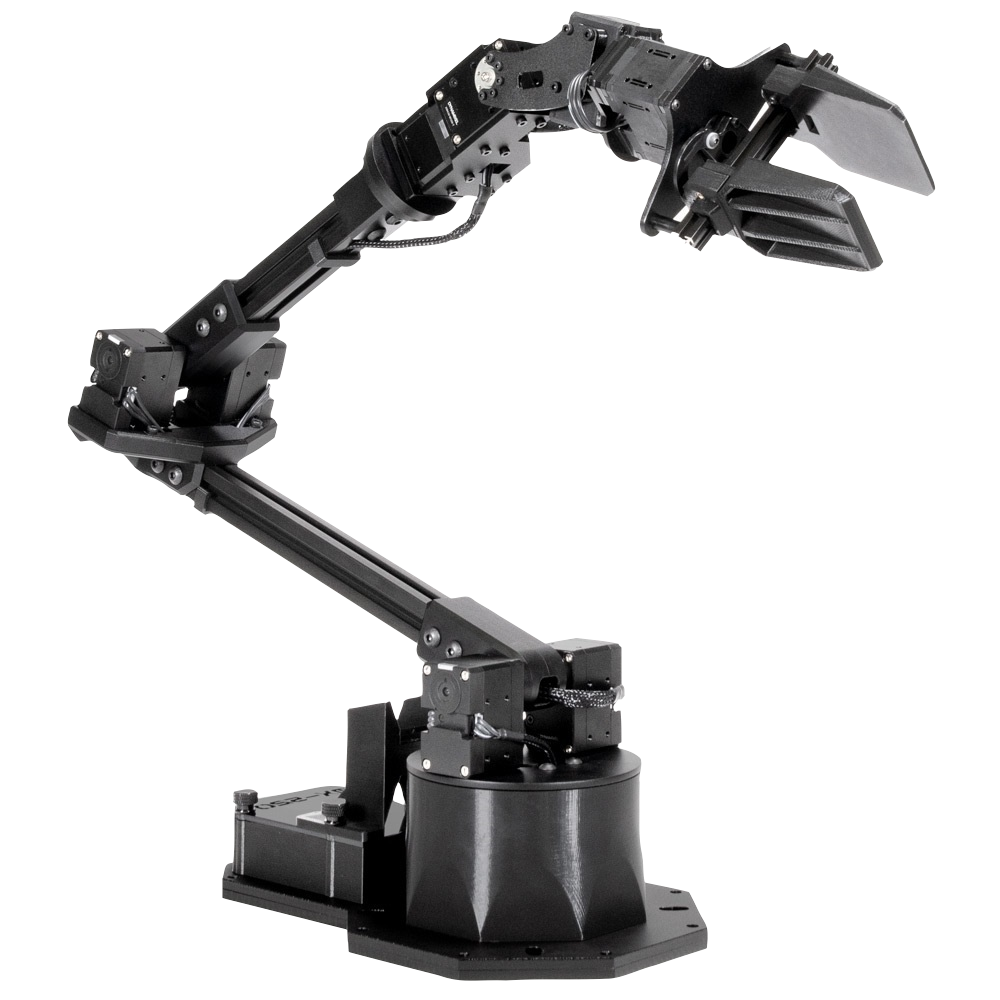
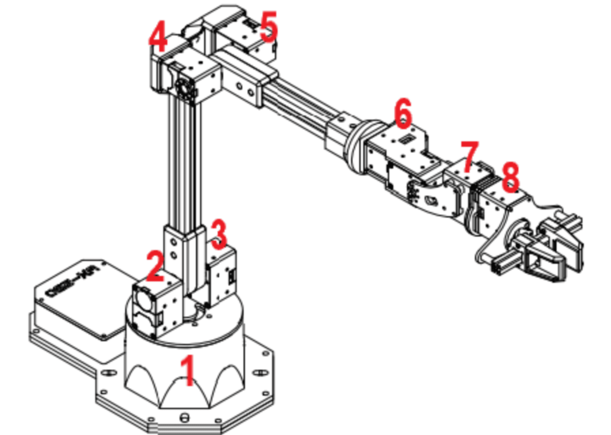

# WidowX 250 Robot Arm Controller



## Overview

This repository contains a controller implementation for the WidowX 250 robot arm, designed to operate with Dynamixel XL430-W250-T motors. The controller provides functionality for initializing the device, scanning for connected motors, controlling joint movements, and recovering from motor errors. The code is specifically optimized for Arduino-compatible platforms and leverages the DynamixelWorkbench library to facilitate motor control operations.

## Features

- **Motor Auto-Detection**: Automatically scans and identifies connected Dynamixel motors
- **Position Control**: Precise joint movement with position feedback
- **Error Recovery**: Advanced error handling and motor recovery protocols
- **Real-time Feedback**: Continuous position monitoring and status reporting
- **Serial Command Interface**: Simple text-based command syntax for manual control
- **Resilient Operation**: Handles connection issues and motor failures gracefully

## Project Structure

```
widowx_250_controller/
├── wx250.cpp         # Core implementation of controller functions
├── wx250.h           # Header file with function declarations and constants
├── wx250.ino         # Arduino entry point with setup and main loop
├── wx250s_drawing.png # Diagram of motor connections
├── wx250s.png        # Image of the WidowX 250 arm
└── README.md         # This documentation file
```

## Hardware Requirements

- Arduino-compatible board (OpenCM or OpenCR recommended)
- WidowX 250 robot arm with Dynamixel XL430-W250-T motors
- Power supply rated for the WidowX 250
- USB connection for serial communication

## Technical Implementation

The controller is implemented across three primary files that work together to provide comprehensive robot arm management:

### wx250.h

This header file defines the core constants and function prototypes used throughout the project:

- Device communication parameters (baudrate, device name)
- Maximum number of supported motors (8)
- Retry and error recovery settings
- Global variable declarations for motor tracking

### wx250.cpp

The implementation file contains the core functionality for motor control:

- **moveJoint()**: Moves a specific joint by a relative position delta with position feedback
- **initDevice()**: Initializes communication and scans for motors
- **resetMotor()**: Attempts to reset a motor that's in an error state
- **forceEnableMotor()**: More aggressive recovery for unresponsive motors
- **printAllPositions()**: Diagnostic function to display current motor positions
- **scanUntilFound()**: Persistent scanning until the required number of motors is detected

### wx250.ino

The Arduino sketch file contains the setup and loop functions:

- **setup()**: Initializes the controller and attempts to find and validate all connected motors
- **loop()**: Main execution loop that tests motors and processes serial commands
- **checkSerialCommands()**: Processes commands received via the Serial interface

## In-Depth Control Logic

The system employs a sophisticated approach to motor control that prioritizes reliability and recovery from error states:

### Motor Initialization Process

1. The controller begins by initializing the DynamixelWorkbench with the appropriate baudrate (1,000,000 bps)
2. It performs an initial scan across the full ID range (1-253) to locate connected motors
3. If the minimum required number of motors isn't found, it enters a persistent scanning mode
4. For each detected motor, the controller:
   - Retrieves and stores the current position
   - Identifies the motor model
   - Attempts recovery if the motor is non-responsive

### Position Control Mechanism

The position control logic employs a multi-step approach:

1. The target motor is confirmed to be in joint mode
2. If joint mode fails, a recovery sequence is attempted
3. The target position is calculated based on the current position plus the requested delta
4. The new position is set as the goal position
5. Current position is read back to verify movement and update tracking
6. This process repeats three times to ensure accurate positioning

### Error Recovery System

The error recovery mechanism is multi-tiered:

1. **Basic Reset**: Attempts to reboot the motor via protocol command
2. **Forced Enable**: If reset fails, attempts to:
   - Verify motor responds to ping
   - Explicitly enable torque
   - Re-initialize joint mode
   - Test functionality with a small movement command

This approach allows the system to recover from a wide range of error conditions, including communication issues, torque overloads, and position tracking errors.

## Serial Command Interface

The system can be controlled via simple text commands sent over Serial:

- `move [motor_id] [position_delta]` - Move a specific motor by the specified amount
- `status` - Display current positions of all motors
- `reset [motor_id]` - Reset a specific motor
- `scan` - Re-scan for connected motors

## Troubleshooting Guide

### Common Issues

#### Motor Detection Problems

The system is designed to detect and use all 8 Dynamixel motors in the WidowX 250 arm. However, under certain conditions, some motors may not be detected during the initial scan.



#### Critical Motor 6-7 Connection Issue

**Problem Description**: When completely shutting down the system, motor #6 may not be detected during subsequent scans, with the system only identifying 5-7 motors instead of the full 8.

**Root Cause Analysis**: The issue appears to be related to the connection between motors 6 and 7 in the daisy-chain configuration. When the system is powered off, this connection can enter an unstable state that persists after power-up.

**Proven Solution**: 

1. When the system is completely shut down, disconnect the communication wire between motors 6 and 7
2. Power up the system
3. Reconnect the wire while the system is powered
4. Run the scanning procedure again

This intervention has been consistently successful in resolving the issue, allowing the system to correctly detect 7 out of the 8 motors. The program will continue to function with 7 motors detected, though full functionality requires all 8.

**Prevention**: To prevent this issue from occurring in the first place, consider:
- Using higher-quality connection cables
- Adding ferrite cores to reduce electrical noise
- Ensuring connectors are firmly seated and free from corrosion
- Implementing a power-up sequence that introduces delays between powering different segments

### Additional Troubleshooting Tips

1. **Communication Errors**: If the communication with motors is unstable, verify your baudrate settings and ensure the physical connections are secure.

2. **Position Tracking Issues**: If position tracking becomes inaccurate, use the `status` command to verify current positions and reset problematic motors if necessary.

3. **Motor Overload**: If motors are being overloaded (indicated by error states and failure to move), reduce movement speed or acceleration values.

4. **Serial Command Failures**: Ensure commands are properly formatted and include all required parameters. Check that line endings are correct (newline character).


## Development Notes

The codebase has been optimized for reliability and recovery from error states, which is particularly important in robotics applications where mechanical failures can cause motors to enter error states.

The multi-stage scanning approach ensures that even in suboptimal conditions, the maximum number of available motors will be detected and utilized.

Position control includes feedback mechanisms that verify movements were successful, providing higher confidence in the arm's actual position compared to systems that only issue commands without verification.

## Future Improvements

- Implement inverse kinematics for end-effector positioning
- Add trajectory planning for smoother movements
- Develop a more comprehensive command interface
- Add support for synchronized multi-motor movements
- Implement torque-based control for force-sensitive operations


## License

This project is licensed under the MIT License. See the [LICENSE](LICENSE) file for details.

## Author

Aayush S. Kulkarni - Created April 4, 2025
